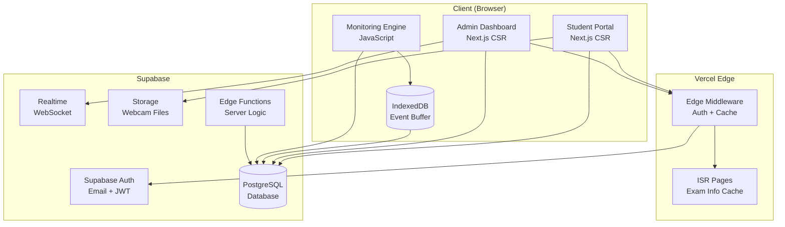
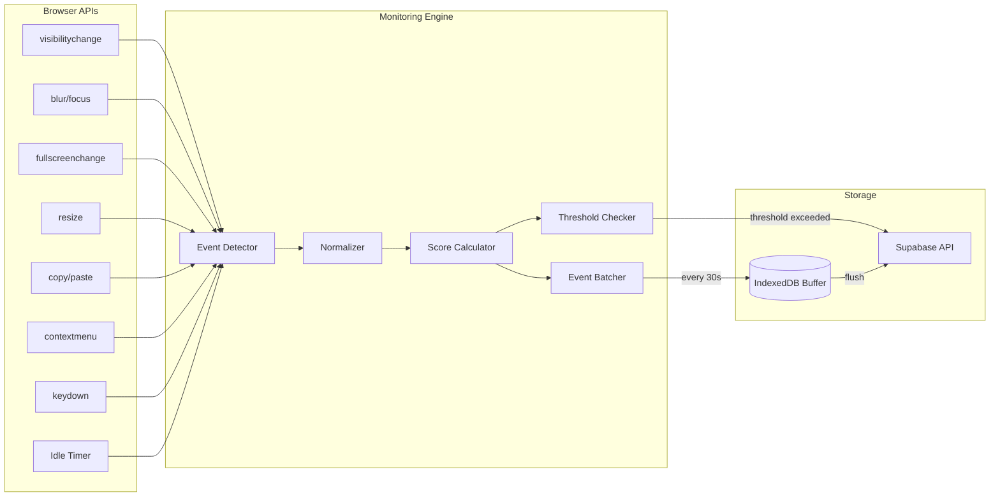
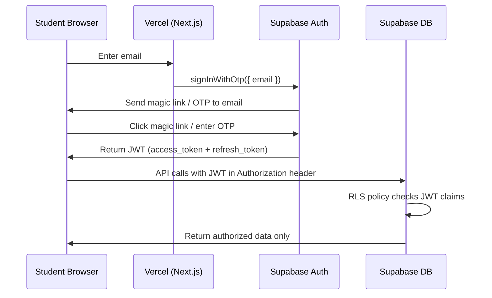
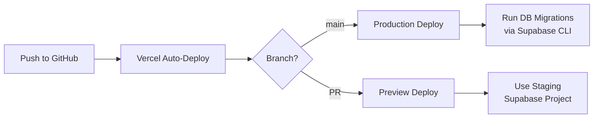

# ExamGuard Cloud — Technical Requirements Document (TRD)

**Version**: 1.0  
**Date**: July 21, 2025  
**Author**: Solutions Architect  
**Status**: Draft  

---

## 1. Technology Stack

### 1.1 Final Stack Selection

| Layer | Technology | Version | Justification |
|-------|-----------|---------|---------------|
| **Frontend Framework** | Next.js (App Router) | 16.x | Already scaffolded; RSC support, edge rendering, Vercel-native |
| **UI Library** | React | 19.x | Already installed; concurrent features, Suspense boundaries |
| **Styling** | TailwindCSS | 4.x | Already installed; rapid prototyping, small bundle |
| **Language** | TypeScript | 5.x | Already configured; type safety critical for complex state management |
| **Backend / BaaS** | Supabase | Latest | PostgreSQL + Auth + Realtime + Storage + Edge Functions |
| **Database** | PostgreSQL (via Supabase) | 15+ | Relational model, RLS, JSONB, full SQL |
| **Auth** | Supabase Auth | Included | Email OTP / magic link; JWT tokens; 50K MAU free |
| **Real-Time** | Supabase Realtime | Included | Postgres LISTEN/NOTIFY via WebSocket; admin dashboard push |
| **File Storage** | Supabase Storage | Included | 1 GB free; webcam snapshots with auto-cleanup |
| **Hosting** | Vercel (Hobby) | Free tier | Global CDN, edge functions, ISR, zero-config Next.js deploy |
| **Package Manager** | npm | 10.x | Default for Next.js scaffold |

### 1.2 Key Libraries (to be installed)

```
# Supabase client
@supabase/supabase-js    — Supabase SDK (auth, DB, realtime, storage)
@supabase/ssr            — Server-side Supabase client for Next.js

# UI & UX
lucide-react             — Icon library (tree-shakeable, lightweight)
sonner                   — Toast notifications
@tanstack/react-table    — Headless table for admin dashboard
recharts                 — Charts for dashboard metrics

# Utilities
zod                      — Schema validation (API inputs, form data)
date-fns                 — Date formatting (lightweight alternative to moment)
uuid                     — Session token generation (client-side fallback)
```

> [!NOTE]
> No ORM is used — we interact with Supabase via its JavaScript SDK, which generates REST queries to PostgREST. This avoids the overhead of Prisma/Drizzle while still providing type safety via generated types from `supabase gen types`.

---

## 2. Architecture Decisions

### ADR-001: Supabase over Firebase
**Decision**: Use Supabase (PostgreSQL) instead of Firebase (Firestore/RTDB).

**Rationale**:
- The existing data model in [Code.gs](file:///c:/Users/mitta/Downloads/ExamGuard%202.0%20%28BackUp%29/ExamGuard%202.0/Code.gs) is inherently relational (Sessions → Students, Activity → Sessions, Reports → Sessions)
- Firebase Firestore imposes **20K writes/day** on free tier — 500 students × 30 heartbeats/exam = 15K writes per exam, leaving almost no headroom
- Reporting requires aggregate queries (`GROUP BY`, `COUNT`, `JOIN`) that Firestore cannot perform
- Supabase's Row-Level Security (RLS) provides database-level authorization without custom middleware
- PostgreSQL JSONB allows hybrid relational + document storage for violation event batches

**Tradeoff**: Supabase has lower storage (500 MB vs 1 GiB) and bandwidth (5 GB vs 10 GB) on free tier, mitigated by aggressive data lifecycle management.

### ADR-002: Keep Google Forms for Exam Delivery
**Decision**: Continue embedding Google Forms in an iframe for question delivery.

**Rationale**:
- Building a custom question engine adds 3-5x complexity and significant storage usage
- Google Forms handles question rendering, response collection, and grading
- ExamGuard's core value is proctoring/monitoring, not question delivery
- Reduces database writes (no answer storage in ExamGuard)

**Tradeoff**: Dependency on Google Forms iframe behavior; Google could restrict embedding in the future.

### ADR-003: Client-Side Monitoring with Server-Side Batched Writes
**Decision**: All violation detection runs in the browser; events are batched and flushed every 30 seconds.

**Rationale**:
- Violation detection (tab switch, focus loss, etc.) requires browser APIs that only work client-side
- Batching reduces write operations by ~10x (from 3,000/min to 300/min for 500 students)
- Client-side IndexedDB buffer prevents data loss during network interruptions

### ADR-004: Edge-First Architecture
**Decision**: Use Vercel Edge Functions (middleware) for static data caching and Supabase Edge Functions for server-side logic.

**Rationale**:
- Exam info, settings, and form URLs don't change during an exam — cache at the edge
- Edge functions have zero cold start (unlike serverless Node.js functions)
- Reduces Supabase API calls by serving repeated requests from cache

---

## 3. System Architecture

### 3.1 High-Level Architecture



### 3.2 Component Breakdown

```
examguard-cloud/
├── src/
│   ├── app/                          # Next.js App Router
│   │   ├── layout.tsx                # Root layout (fonts, metadata, providers)
│   │   ├── page.tsx                  # Landing / redirect
│   │   ├── (student)/                # Student route group
│   │   │   ├── exam/
│   │   │   │   └── page.tsx          # Main exam portal (login → exam → done)
│   │   │   └── layout.tsx            # Student layout (no admin nav)
│   │   ├── (admin)/                  # Admin route group
│   │   │   ├── dashboard/
│   │   │   │   └── page.tsx          # Live dashboard
│   │   │   ├── forms/
│   │   │   │   └── page.tsx          # Form management
│   │   │   ├── students/
│   │   │   │   └── page.tsx          # Roster management
│   │   │   ├── settings/
│   │   │   │   └── page.tsx          # Configuration panel
│   │   │   ├── reports/
│   │   │   │   └── page.tsx          # Report generation + export
│   │   │   └── layout.tsx            # Admin layout (sidebar nav, auth guard)
│   │   └── api/                      # API routes (if needed beyond Supabase)
│   │       └── health/
│   │           └── route.ts          # Health check endpoint
│   ├── components/
│   │   ├── ui/                       # Reusable UI primitives
│   │   │   ├── Button.tsx
│   │   │   ├── Card.tsx
│   │   │   ├── Table.tsx
│   │   │   ├── Modal.tsx
│   │   │   ├── Badge.tsx
│   │   │   └── Input.tsx
│   │   ├── student/                  # Student-specific components
│   │   │   ├── LoginScreen.tsx
│   │   │   ├── ExamInfoScreen.tsx
│   │   │   ├── PreExamChecklist.tsx
│   │   │   ├── ExamScreen.tsx        # Form iframe + monitoring overlay
│   │   │   ├── CompletionScreen.tsx
│   │   │   └── BlockedScreen.tsx
│   │   ├── admin/                    # Admin-specific components
│   │   │   ├── SessionGrid.tsx
│   │   │   ├── MetricsBar.tsx
│   │   │   ├── ActivityFeed.tsx
│   │   │   ├── FormEditor.tsx
│   │   │   ├── RosterManager.tsx
│   │   │   └── SettingsPanel.tsx
│   │   └── monitoring/              # Proctoring engine components
│   │       ├── MonitoringProvider.tsx # React context for monitoring state
│   │       ├── ViolationOverlay.tsx   # Score + violation warnings
│   │       └── WebcamCapture.tsx      # Periodic snapshot component
│   ├── lib/
│   │   ├── supabase/
│   │   │   ├── client.ts            # Browser Supabase client
│   │   │   ├── server.ts            # Server-side Supabase client
│   │   │   ├── middleware.ts         # Supabase auth middleware helper
│   │   │   └── types.ts             # Generated database types
│   │   ├── monitoring/
│   │   │   ├── engine.ts            # Core monitoring engine (event detection)
│   │   │   ├── events.ts            # Event type definitions & normalization
│   │   │   ├── batcher.ts           # Event batching & flush logic
│   │   │   ├── scorer.ts            # Integrity score calculation
│   │   │   └── buffer.ts            # IndexedDB offline buffer
│   │   ├── utils/
│   │   │   ├── validation.ts        # Zod schemas for API inputs
│   │   │   ├── dates.ts             # Date formatting helpers
│   │   │   └── constants.ts         # App-wide constants
│   │   └── hooks/
│   │       ├── useSession.ts        # Exam session state management
│   │       ├── useMonitoring.ts     # Monitoring engine React hook
│   │       ├── useRealtimeDashboard.ts  # Admin real-time subscription
│   │       └── useExamInfo.ts       # Exam metadata fetching
│   ├── middleware.ts                 # Next.js edge middleware (auth redirect)
│   └── types/
│       └── exam.ts                   # Shared TypeScript interfaces
├── supabase/
│   ├── migrations/                   # SQL migration files
│   │   └── 001_initial_schema.sql
│   ├── seed.sql                      # Default settings data
│   └── config.toml                   # Supabase local dev config
└── public/
    └── ...                           # Static assets
```

---

## 4. Free-Tier Optimization Deep-Dive

### 4.1 Supabase API Call Budget

**Scenario**: 500 students, 60-minute exam, heartbeat every 30 seconds

```
Session starts:     500 writes (1 per student)
Heartbeat flushes:  500 students × (60 min ÷ 0.5 min) = 60,000 writes
                    Batched: 500 × 120 = 60,000 → stored as 60,000 JSONB appends
                    Optimized: 500 × 120 upserts = 60,000 operations
Session ends:       500 writes
Exam info reads:    500 reads (cached after first)
Admin dashboard:    ~200 reads/exam (realtime, not polling)

Total per exam:     ~61,200 operations
Monthly (4 exams):  ~245,000 operations
```

> [!TIP]
> This is well within Supabase's free tier since there are no hard operation limits on the database itself — only bandwidth and storage matter.

### 4.2 Bandwidth Optimization

```
Average heartbeat payload:     ~500 bytes (JSON with 1-5 events)
Average exam info response:    ~2 KB (cached after first load)
Average session start/end:     ~1 KB each

Per exam bandwidth:
  Heartbeats: 500 students × 120 calls × 500 bytes = 30 MB
  Reads:      500 × 2 KB + 200 admin reads × 5 KB = 2 MB
  Session:    500 × 2 KB = 1 MB
  Total:      ~33 MB per exam

Monthly (4 exams):  ~132 MB << 5 GB limit ✅
```

### 4.3 Storage Growth Estimate

```
Per exam (without webcam):
  Sessions:    500 rows × 500 bytes = 250 KB
  Activities:  500 students × 30 events × 200 bytes = 3 MB
  Reports:     500 rows × 800 bytes = 400 KB
  Total:       ~3.65 MB per exam

Per semester (20 exams): ~73 MB << 500 MB limit ✅

With webcam (optional):
  500 students × 60 snapshots × 30 KB (compressed) = 900 MB ⚠️
  Mitigation: 7-day auto-delete + reduce to 15-second interval only for flagged students
```

---

## 5. API Design

### 5.1 Student API (via Supabase Client SDK)

All student operations use the Supabase JavaScript SDK with RLS policies — no custom API routes needed.

| Operation | Supabase Method | RLS Policy |
|-----------|----------------|------------|
| Get exam info | `supabase.from('forms').select()` where `active = true` | Public read (no auth needed) |
| Lookup student | `supabase.from('students').select().eq('email', email)` | Public read (email match) |
| Start session | `supabase.from('sessions').insert()` | Authenticated insert (email match) |
| Log events | `supabase.from('sessions').update().eq('token', token)` | Authenticated update (own token only) |
| Insert activity batch | `supabase.from('activity_events').insert()` | Authenticated insert (own session) |
| End session | `supabase.from('sessions').update().eq('token', token)` | Authenticated update (own token) |
| Upload snapshot | `supabase.storage.from('webcam').upload()` | Authenticated upload (own folder) |

### 5.2 Admin API (via Supabase Client SDK + RLS)

| Operation | Supabase Method | RLS Policy |
|-----------|----------------|------------|
| Get all sessions | `supabase.from('sessions').select()` | Admin role check |
| Get dashboard metrics | `supabase.rpc('get_dashboard_metrics')` | Admin role check |
| Save settings | `supabase.from('config').upsert()` | Admin role check |
| Manage forms | `supabase.from('forms').insert/update/delete()` | Admin role check |
| Import students | `supabase.from('students').upsert()` | Admin role check |
| End session | `supabase.from('sessions').update()` | Admin role check |
| Generate report | `supabase.rpc('generate_report')` | Admin role check |
| Subscribe to changes | `supabase.channel('sessions').on('postgres_changes', ...)` | Admin role check |

### 5.3 Database Functions (Supabase RPC)

```sql
-- get_dashboard_metrics: Aggregates session counts in a single query
CREATE OR REPLACE FUNCTION get_dashboard_metrics(target_form_id UUID DEFAULT NULL)
RETURNS JSON AS $$
  SELECT json_build_object(
    'active', COUNT(*) FILTER (WHERE status = 'ACTIVE'),
    'completed', COUNT(*) FILTER (WHERE status = 'COMPLETED'),
    'terminated', COUNT(*) FILTER (WHERE status = 'TERMINATED'),
    'alert', COUNT(*) FILTER (WHERE status = 'ACTIVE' AND score < 80),
    'total', COUNT(*)
  )
  FROM sessions
  WHERE (target_form_id IS NULL OR form_id = target_form_id);
$$ LANGUAGE sql STABLE;

-- cleanup_old_exams: Archive data older than N days
CREATE OR REPLACE FUNCTION cleanup_old_exams(days_old INT DEFAULT 180)
RETURNS INT AS $$
DECLARE deleted_count INT;
BEGIN
  DELETE FROM activity_events
  WHERE session_id IN (
    SELECT id FROM sessions WHERE started_at < NOW() - (days_old || ' days')::INTERVAL
  );
  DELETE FROM sessions WHERE started_at < NOW() - (days_old || ' days')::INTERVAL;
  GET DIAGNOSTICS deleted_count = ROW_COUNT;
  RETURN deleted_count;
END;
$$ LANGUAGE plpgsql;
```

---

## 6. Client-Side Monitoring Engine

### 6.1 Architecture



### 6.2 Event Detection Matrix

| Event Type | Browser API | Detection Method | Deduction Default |
|-----------|------------|-----------------|-------------------|
| `tab_switch` | `document.visibilitychange` | `document.hidden === true` | 5 |
| `focus_loss` | `window.blur` | Window loses focus | 5 |
| `fullscreen_exit` | `document.fullscreenchange` | `!document.fullscreenElement` | 5 |
| `split_screen` | `window.resize` | `window.outerWidth < screen.width * 0.9` | 5 |
| `copy` | `document.oncopy` | Copy event fired | 3 |
| `paste` | `document.onpaste` | Paste event fired | 3 |
| `right_click` | `document.oncontextmenu` | Context menu event (prevented) | 1 |
| `keyboard_shortcut` | `document.onkeydown` | Restricted combos detected | 5 |
| `devtools` | Size differential | `window.outerWidth - window.innerWidth > 160` | 5 |
| `idle` | Custom timer | No mouse/keyboard/touch for N seconds | 5 |

### 6.3 Event Batching Protocol

```typescript
interface EventBatch {
  session_token: string;
  events: Array<{
    type: string;
    timestamp: string;      // ISO 8601
    duration?: number;       // seconds (for idle events)
    detail?: string;         // e.g., "Ctrl+C", "F12"
  }>;
  current_score: number;
  total_violations: number;
}

// Flush strategy:
// 1. Collect events in memory array
// 2. Every 30 seconds OR when array reaches 10 events, flush
// 3. On flush: write to IndexedDB first (durability), then POST to Supabase
// 4. On success: clear IndexedDB batch
// 5. On failure: retain in IndexedDB, retry on next flush cycle
```

---

## 7. Connection Management for 500 Students

### 7.1 Connection Architecture

```
500 Students (REST only — no WebSocket)
  ├── Auth: Supabase Auth (JWT token, cached client-side)
  ├── Reads: GET exam info (edge-cached, 1 Supabase hit per 60 seconds via ISR)
  ├── Writes: POST event batches every 30 seconds (500 concurrent POST requests)
  └── No persistent connections (HTTP/2 multiplexing on Vercel)

5-10 Admins (REST + WebSocket)
  ├── Auth: Supabase Auth (admin role)
  ├── Realtime: 1 WebSocket per admin via Supabase Realtime channel
  └── Reads: Dashboard data pushed via Realtime subscription
```

> [!IMPORTANT]
> **Students do NOT use WebSocket connections.** All student interactions are stateless REST calls (via Supabase SDK over HTTPS). Only admin dashboards subscribe to Supabase Realtime channels. This keeps WebSocket usage to 5-10 connections out of the 200 free-tier limit.

### 7.2 Supabase Connection Pooling

Supabase free tier uses **Supavisor** (connection pooler) with:
- **Transaction mode**: Connections are shared across requests
- **Max connections**: Effective ~20 direct connections, but pooler handles hundreds of concurrent API requests
- **PostgREST**: Supabase's REST API layer handles connection pooling internally

No additional configuration needed — Supabase SDK requests go through PostgREST, which is designed for high-concurrency REST workloads.

---

## 8. Security Architecture

### 8.1 Authentication Flow



> [!NOTE]
> **Simplified auth option**: For v1, we can use `signInAnonymously()` + email claim to reduce friction. Students enter their email, get an anonymous session tagged with that email, and RLS policies check the email claim. This avoids the magic link step while still providing JWT-based security. Full email verification can be added in v2.

### 8.2 Row-Level Security (RLS) Policies

```sql
-- Students can only read their own session
CREATE POLICY "students_read_own_session" ON sessions
  FOR SELECT
  USING (email = auth.jwt() ->> 'email');

-- Students can only update their own active session
CREATE POLICY "students_update_own_session" ON sessions
  FOR UPDATE
  USING (email = auth.jwt() ->> 'email' AND status = 'ACTIVE');

-- Students can insert activity only for their own session
CREATE POLICY "students_insert_activity" ON activity_events
  FOR INSERT
  WITH CHECK (
    session_id IN (
      SELECT id FROM sessions WHERE email = auth.jwt() ->> 'email'
    )
  );

-- Admins can read/write everything
CREATE POLICY "admin_full_access" ON sessions
  FOR ALL
  USING (
    EXISTS (
      SELECT 1 FROM user_roles WHERE user_id = auth.uid() AND role IN ('admin', 'ta')
    )
  );
```

### 8.3 API Security Measures

| Measure | Implementation |
|---------|---------------|
| CORS | Restrict to `examguard.vercel.app` domain only |
| Rate Limiting | Supabase built-in rate limiting + client-side debounce |
| Input Validation | Zod schemas on all API inputs (client + server) |
| XSS Prevention | Next.js built-in CSP headers; React's JSX auto-escaping |
| CSRF Protection | Supabase JWT tokens (not cookies); SameSite headers |
| SQL Injection | PostgREST parameterized queries (no raw SQL from client) |
| Token Security | Session tokens are UUIDs (unpredictable); stored in sessionStorage (not localStorage) |

---

## 9. Caching Strategy

### 9.1 Three-Layer Cache Architecture

```
┌─────────────────────────────────────────────────┐
│ Layer 1: Vercel Edge Cache                       │
│ • Exam info page (ISR, revalidate: 60s)          │
│ • Static assets (immutable, CDN)                 │
│ • Settings JSON (edge middleware cache)           │
│ TTL: 60 seconds for dynamic, forever for static  │
├─────────────────────────────────────────────────┤
│ Layer 2: Client-Side Cache                       │
│ • Session state (sessionStorage)                 │
│ • Exam info (React Query cache, 5 min)           │
│ • Event buffer (IndexedDB, until flushed)        │
│ TTL: Session-scoped or explicit                  │
├─────────────────────────────────────────────────┤
│ Layer 3: Supabase Internal Cache                 │
│ • PostgREST connection pool                      │
│ • PostgreSQL shared_buffers                      │
│ TTL: Managed by Supabase                         │
└─────────────────────────────────────────────────┘
```

### 9.2 What to Cache vs. What to Always Fetch

| Data | Cache Strategy | Reason |
|------|---------------|--------|
| Exam info (forms, settings) | Edge cache, 60s TTL | Doesn't change during exam |
| Student roster | Client cache, 5 min | Rarely changes |
| Session state | sessionStorage | Needed for resume on reload |
| Violation events | IndexedDB buffer | Durability before server write |
| Dashboard sessions | Supabase Realtime (push) | Must be live for admin |
| Activity feed | Supabase Realtime (push) | Must be live for admin |
| Report data | Never cache | Generated on-demand, must be fresh |

---

## 10. Error Handling Patterns

### 10.1 Client-Side Error Categories

| Category | Example | Handling |
|----------|---------|---------|
| **Network Error** | Supabase unreachable | Buffer events in IndexedDB; show "Offline" badge; retry with exponential backoff |
| **Auth Error** | JWT expired | Silent refresh via `supabase.auth.refreshSession()`; re-enqueue failed request |
| **Session Error** | Session not found / terminated | Show BlockedScreen with clear message; stop monitoring engine |
| **Validation Error** | Invalid email format | Show inline error; prevent submission |
| **Rate Limit** | 429 from Supabase | Back off; increase batch interval temporarily |
| **Unknown Error** | Unexpected exception | Log to console; show generic "Something went wrong" with retry button |

### 10.2 Graceful Degradation Levels

```
Level 0: Full functionality
  └── All systems operational

Level 1: Degraded monitoring
  └── Supabase slow/unreachable → events buffered locally
  └── Student can still see the Google Form and take the exam
  └── Events flush when connection restores

Level 2: Read-only mode
  └── Database writes fail → student warned "monitoring paused"
  └── Exam continues; events stored in IndexedDB for manual export

Level 3: Complete offline
  └── No network at all → "Check your internet connection" overlay
  └── Exam paused; timer paused; events buffered
  └── Auto-resume on reconnection
```

---

## 11. Deployment Architecture

### 11.1 Environment Setup

| Environment | Purpose | Supabase Project | Vercel |
|-------------|---------|-----------------|--------|
| `local` | Development | Supabase CLI (local Docker) | `next dev` on localhost:3000 |
| `preview` | PR previews | Supabase staging project (free) | Vercel preview deployments |
| `production` | Live exams | Supabase production project (free) | Vercel production (`main` branch) |

### 11.2 CI/CD Pipeline



### 11.3 Environment Variables

```env
# .env.local (development)
NEXT_PUBLIC_SUPABASE_URL=http://localhost:54321
NEXT_PUBLIC_SUPABASE_ANON_KEY=your-local-anon-key

# Vercel Environment Variables (production)
NEXT_PUBLIC_SUPABASE_URL=https://xxxx.supabase.co
NEXT_PUBLIC_SUPABASE_ANON_KEY=eyJ...
SUPABASE_SERVICE_ROLE_KEY=eyJ...    # Server-side only, never exposed to client
```
