# ExamGuard Cloud — App Flow Document

**Version**: 1.0  
**Date**: July 21, 2025  
**Author**: Solutions Architect  

---

## 1. Student User Journey

### 1.1 Complete Student Flow

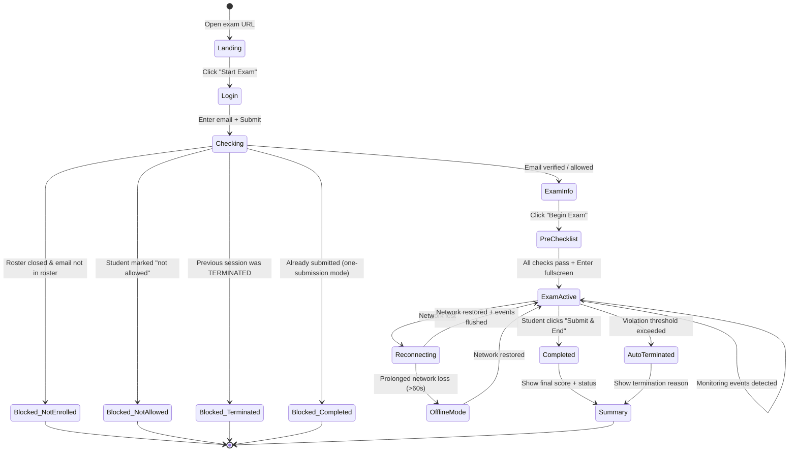

### 1.2 Screen-by-Screen Breakdown

#### Screen 1: Landing Page
```
┌──────────────────────────────────────────────┐
│                                              │
│            🛡️ ExamGuard                      │
│         Masters Union                        │
│                                              │
│   ┌──────────────────────────────────────┐   │
│   │                                      │   │
│   │    Welcome to your secure exam       │   │
│   │    environment                       │   │
│   │                                      │   │
│   │    📋 Exam: Midterm Quiz #3          │   │
│   │    🕐 Window: 10:00 AM - 11:30 AM   │   │
│   │    ⏱️ Duration: 90 minutes           │   │
│   │                                      │   │
│   │    [ Enter Exam Portal →  ]          │   │
│   │                                      │   │
│   └──────────────────────────────────────┘   │
│                                              │
│   ⚠️ Desktop browser required (Chrome/Edge)  │
│   v3.0 Cloud                                 │
│                                              │
└──────────────────────────────────────────────┘
```

#### Screen 2: Email Login
```
┌──────────────────────────────────────────────┐
│  🛡️ ExamGuard          Masters Union         │
│──────────────────────────────────────────────│
│                                              │
│   Enter your institutional email             │
│                                              │
│   ┌──────────────────────────────────────┐   │
│   │ student@mastersunion.org             │   │
│   └──────────────────────────────────────┘   │
│                                              │
│   [ Continue → ]                             │
│                                              │
│   🔒 Your email is used to verify your       │
│   identity and track your exam session.      │
│                                              │
└──────────────────────────────────────────────┘
```

#### Screen 3: Pre-Exam Checklist
```
┌──────────────────────────────────────────────┐
│  🛡️ ExamGuard          Midterm Quiz #3       │
│──────────────────────────────────────────────│
│                                              │
│   Pre-Exam Readiness Check                   │
│                                              │
│   ✅ Browser supported (Chrome 120)          │
│   ✅ Screen size adequate (1920×1080)        │
│   ✅ Clipboard monitoring enabled            │
│   ✅ Tab switch detection enabled            │
│   ⬜ Fullscreen mode (click to activate)     │
│   ⬜ Webcam access (optional)                │
│                                              │
│   ┌──────────────────────────────────────┐   │
│   │  ⚠️ During this exam:               │   │
│   │  • Do not switch tabs or windows     │   │
│   │  • Do not use copy/paste             │   │
│   │  • Stay in fullscreen mode           │   │
│   │  • Violations reduce your score      │   │
│   └──────────────────────────────────────┘   │
│                                              │
│   [ Start Exam → ]   (requires all checks)   │
│                                              │
└──────────────────────────────────────────────┘
```

#### Screen 4: Active Exam
```
┌──────────────────────────────────────────────┐
│  🛡️ Score: 95  │  ⏱️ 47:23 remaining  │ 🔴  │
│──────────────────────────────────────────────│
│                                              │
│  ┌──────────────────────────────────────────┐│
│  │                                          ││
│  │     Google Form (iframe)                 ││
│  │                                          ││
│  │     Question 1 of 25                     ││
│  │     What is the capital of...            ││
│  │                                          ││
│  │     ○ Option A                           ││
│  │     ○ Option B                           ││
│  │     ○ Option C                           ││
│  │     ○ Option D                           ││
│  │                                          ││
│  │                                          ││
│  └──────────────────────────────────────────┘│
│                                              │
│  [ Submit & End Exam ]                       │
│                                              │
└──────────────────────────────────────────────┘

Violation Toast (appears temporarily):
┌────────────────────────────────┐
│ ⚠️ Tab switch detected (-5)    │
│ Return to the exam immediately │
└────────────────────────────────┘
```

#### Screen 5: Completion / Termination
```
┌──────────────────────────────────────────────┐
│  🛡️ ExamGuard          Masters Union         │
│──────────────────────────────────────────────│
│                                              │
│   ✅ Exam Submitted Successfully             │
│                                              │
│   ┌──────────────────────────────────────┐   │
│   │  Integrity Score:  85 / 100          │   │
│   │  Status:           COMPLETED         │   │
│   │  Violations:       3                 │   │
│   │  Duration:         42 minutes        │   │
│   │                                      │   │
│   │  Tab switches:     2                 │   │
│   │  Focus losses:     1                 │   │
│   └──────────────────────────────────────┘   │
│                                              │
│   Your responses have been recorded in       │
│   Google Forms. You may close this window.   │
│                                              │
└──────────────────────────────────────────────┘
```

---

## 2. Admin User Journey

### 2.1 Admin Navigation Flow

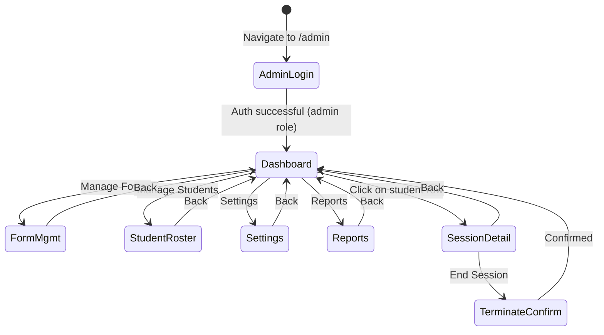

### 2.2 Admin Dashboard Layout

```
┌────────────────────────────────────────────────────────────────┐
│  🛡️ ExamGuard Admin                      👤 prof@mu.edu  ⚙️   │
├──────────┬─────────────────────────────────────────────────────┤
│          │                                                     │
│  📊 Dash │  Live Dashboard              Last updated: 10:23   │
│          │                                                     │
│  📝 Forms│  ┌────────┐ ┌────────┐ ┌────────┐ ┌────────┐       │
│          │  │Active  │ │Done    │ │Flagged │ │Total   │       │
│  👥 Stud.│  │  247   │ │  198   │ │   12   │ │  457   │       │
│          │  └────────┘ └────────┘ └────────┘ └────────┘       │
│  ⚙️ Set. │                                                     │
│          │  ┌─────────────────────────────────────────────┐     │
│  📈 Rep. │  │ Student        │Score│Violations│Status    │     │
│          │  ├────────────────┼─────┼──────────┼──────────┤     │
│          │  │ 🔴 R.Sharma    │  45 │    12    │ ACTIVE   │     │
│          │  │ 🟡 A.Patel     │  72 │     6    │ ACTIVE   │     │
│          │  │ 🟢 S.Singh     │  98 │     1    │ ACTIVE   │     │
│          │  │ ⬛ K.Kumar     │  88 │     3    │ COMPLETED│     │
│          │  │ ...            │     │          │          │     │
│          │  └─────────────────────────────────────────────┘     │
│          │                                                     │
│          │  [ End All Sessions ]   [ Generate Report ]         │
│          │                                                     │
│          │  Recent Activity                                    │
│          │  ┌─────────────────────────────────────────────┐     │
│          │  │ 10:22  R.Sharma  tab_switch  (3rd time)    │     │
│          │  │ 10:21  A.Patel   copy        Ctrl+C        │     │
│          │  │ 10:20  M.Verma   focus_loss  Alt+Tab        │     │
│          │  └─────────────────────────────────────────────┘     │
└──────────┴─────────────────────────────────────────────────────┘
```

---

## 3. System Sequence Diagrams

### 3.1 Session Start Flow

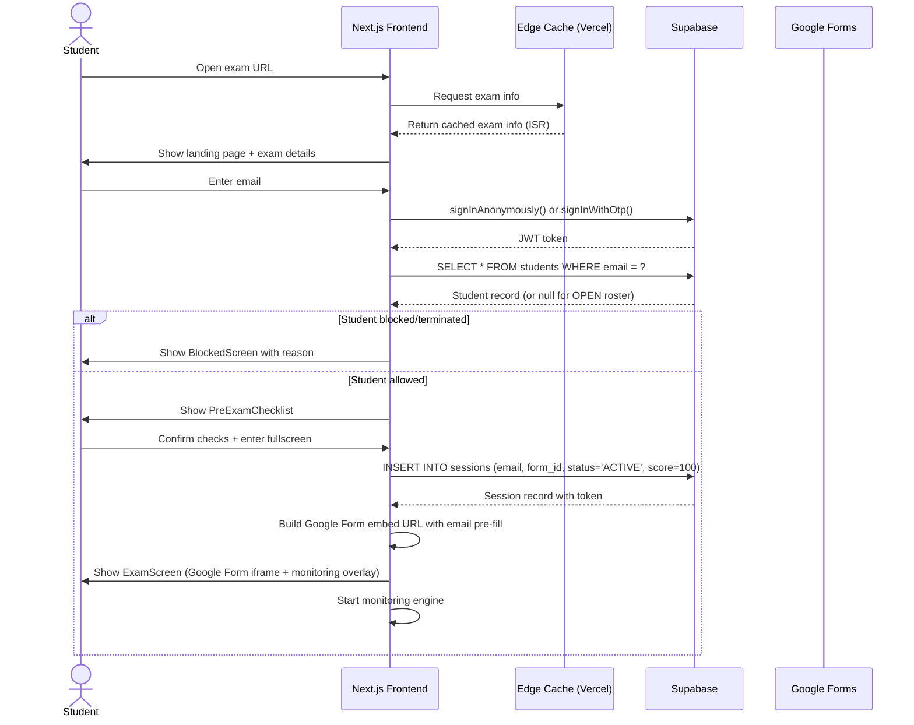

### 3.2 Heartbeat & Violation Detection Flow

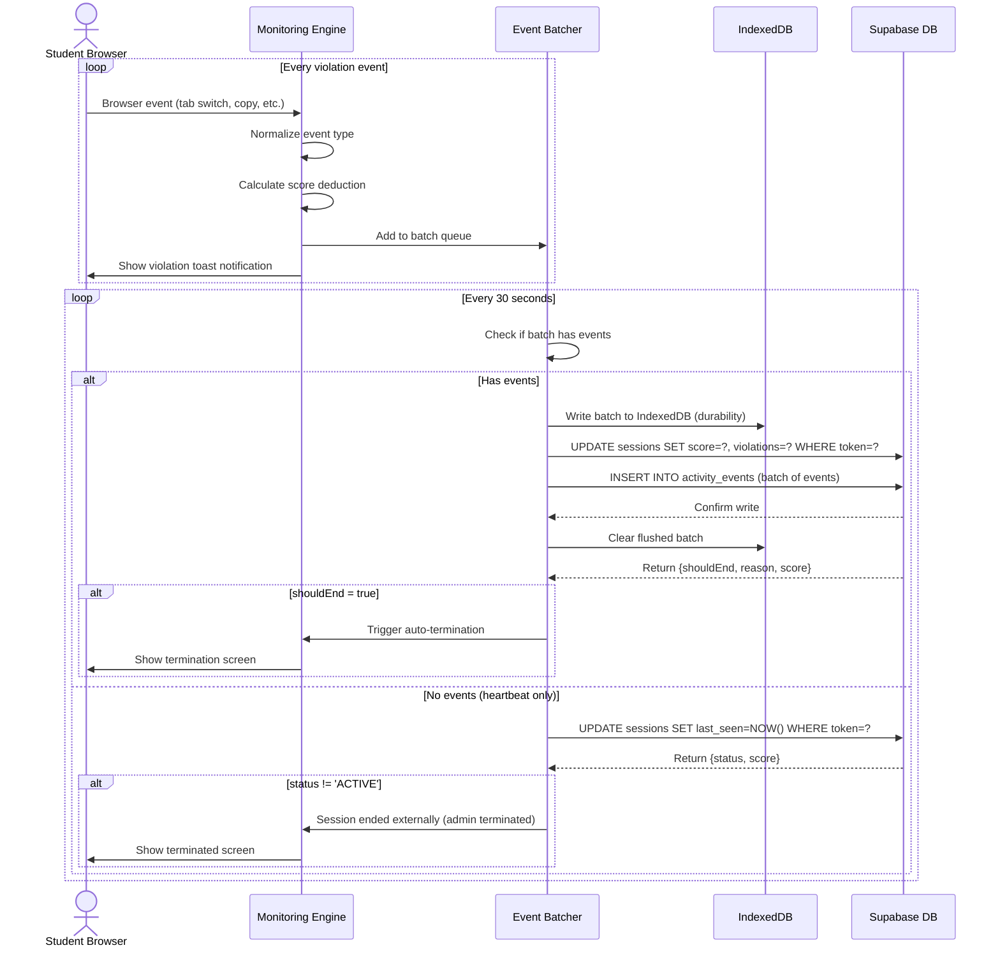

### 3.3 Auto-Termination Flow

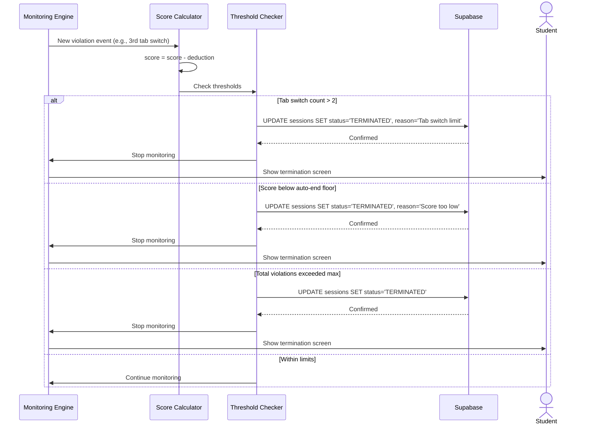

### 3.4 Admin Real-Time Monitoring Flow

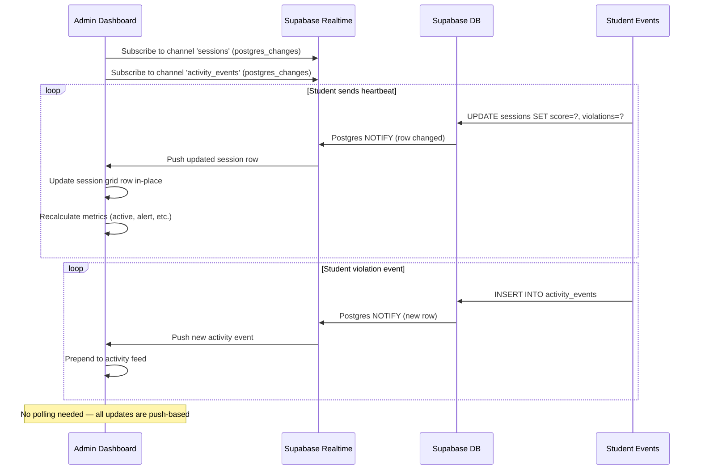

---

## 4. Data Flow Diagrams

### 4.1 Write Path (Student → Database)

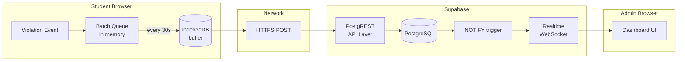

### 4.2 Read Path (Database → Admin)

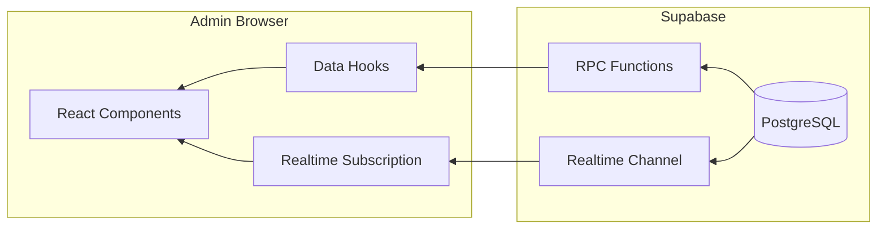

---

## 5. Error & Recovery Flows

### 5.1 Network Interruption Recovery

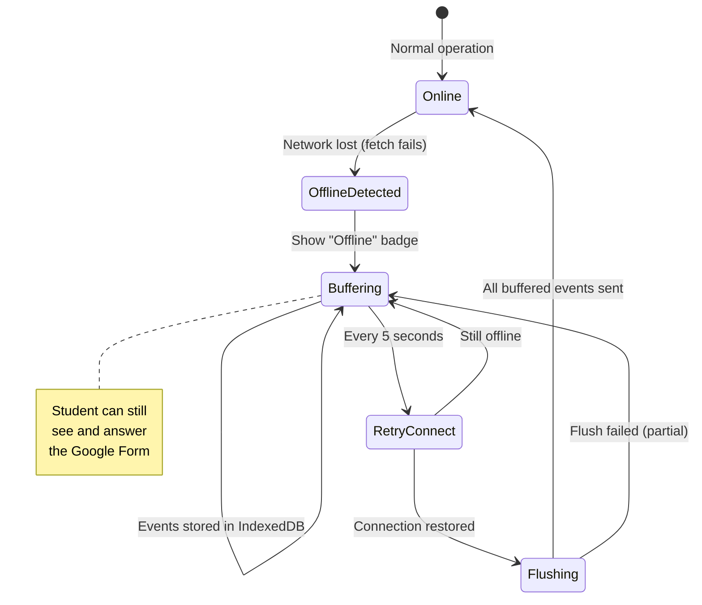

### 5.2 Session Conflict Resolution

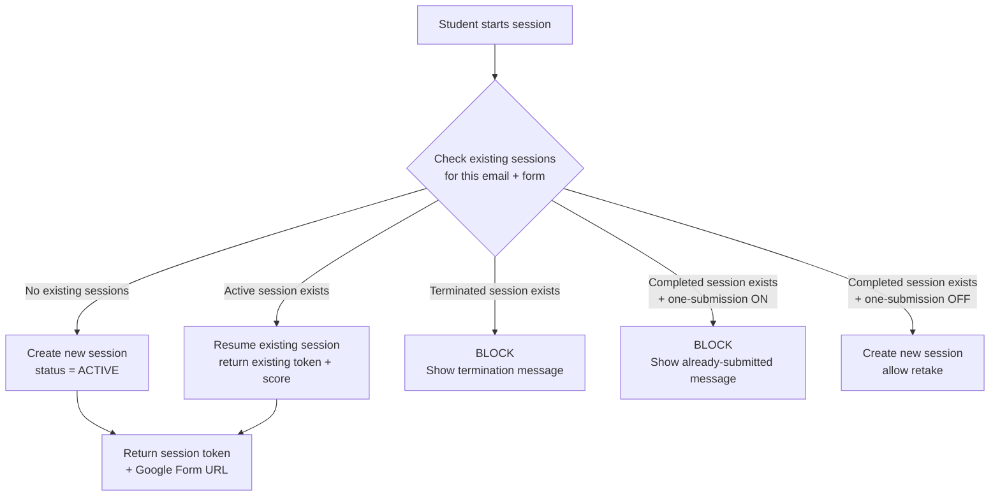

---

## 6. Page Routing Map

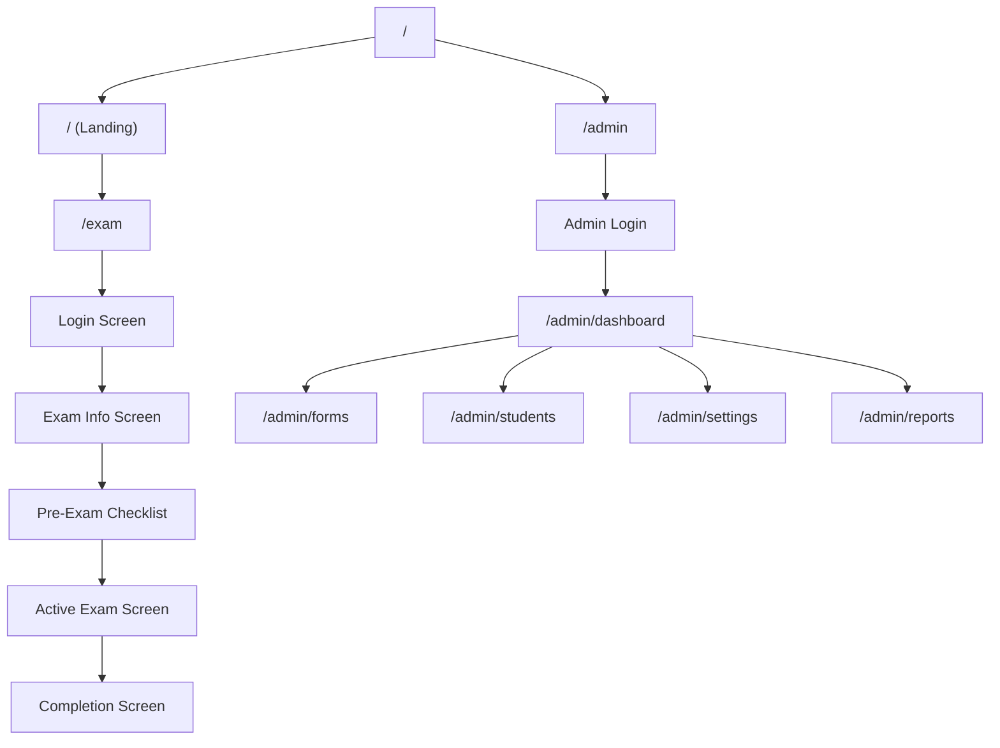

> [!NOTE]
> The student exam portal (`/exam`) is a **single-page flow** — all screens (login → checklist → exam → done) are managed by React state within one page component. This avoids page reloads that would disrupt the monitoring engine and fullscreen mode.

> [!IMPORTANT]
> The admin section (`/admin/*`) uses Next.js App Router with separate pages for each feature. Navigation between admin pages is standard — no fullscreen or monitoring constraints.
