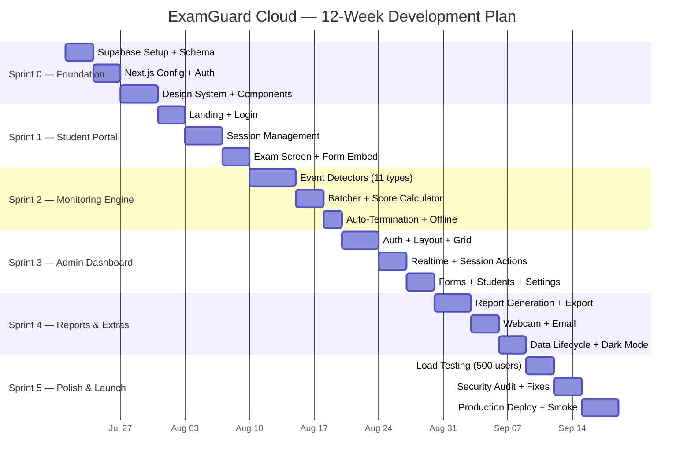

# ExamGuard Cloud — Implementation Workflow

**Version**: 1.0  
**Date**: July 21, 2025  
**Author**: Solutions Architect  

---

## 1. Development Philosophy

### 1.1 Guiding Principles

| Principle | Application |
|-----------|-------------|
| **Vertical slices** | Each sprint delivers a working, testable feature — not horizontal layers |
| **Student-first** | Student portal is built and tested before admin dashboard |
| **Free-tier conscious** | Every feature decision is validated against Supabase/Vercel quotas |
| **Progressive enhancement** | Core flow (login → exam → done) works first; monitoring is layered on |
| **Type-safe from day 1** | TypeScript strict mode; Zod validation; generated Supabase types |

### 1.2 Sprint Structure

```
Sprint duration:    2 weeks
Total sprints:      6 (12 weeks)
Team assumption:    1-2 developers
Review cadence:     End of each sprint

Sprint 0: Foundation (Setup + Infra)
Sprint 1: Student Portal Core
Sprint 2: Monitoring Engine
Sprint 3: Admin Dashboard
Sprint 4: Reports, Webcam, Email
Sprint 5: Polish, Testing, Launch
```

---

## 2. Sprint Breakdown

### Sprint 0: Foundation (Week 1-2)

**Goal**: Project infrastructure is ready; development environment works end-to-end.

#### Tasks

| # | Task | Estimated Hours | Priority |
|---|------|----------------|----------|
| 0.1 | Create Supabase project (free tier) | 0.5h | P0 |
| 0.2 | Run initial migration SQL (all tables, indexes, RLS, functions, seed data) | 2h | P0 |
| 0.3 | Generate TypeScript types from Supabase schema (`supabase gen types`) | 0.5h | P0 |
| 0.4 | Install dependencies (supabase-js, zod, lucide, sonner, date-fns, etc.) | 1h | P0 |
| 0.5 | Set up Supabase client (browser + server) in `lib/supabase/` | 2h | P0 |
| 0.6 | Configure Next.js middleware for auth redirects | 2h | P0 |
| 0.7 | Set up TailwindCSS design tokens (colors, spacing, typography from UI/UX Brief) | 3h | P0 |
| 0.8 | Create reusable UI components (Button, Card, Input, Badge, Modal) | 4h | P0 |
| 0.9 | Set up page routing structure (`(student)/exam`, `(admin)/dashboard`, etc.) | 2h | P0 |
| 0.10 | Configure environment variables (`.env.local`, Vercel env vars) | 0.5h | P0 |
| 0.11 | Set up Vercel project and connect GitHub repo | 1h | P1 |
| 0.12 | Configure Supabase local development (CLI + Docker) | 2h | P1 |

**Total**: ~20 hours

#### Definition of Done (Sprint 0)
- [ ] `npm run dev` starts without errors
- [ ] Supabase client connects and can read/write to `config` table
- [ ] UI component library renders correctly
- [ ] Page routing works: `/exam` and `/admin/dashboard` render placeholder content
- [ ] TypeScript strict mode passes with no errors
- [ ] Vercel preview deployment works on push to `main`

#### Deliverables
- Working local dev environment
- Supabase project with full schema
- Component library with design system
- CI/CD pipeline (GitHub → Vercel)

---

### Sprint 1: Student Portal Core (Week 3-4)

**Goal**: A student can log in, see exam info, start a session, view the Google Form, and submit.

#### Tasks

| # | Task | Estimated Hours | Priority |
|---|------|----------------|----------|
| 1.1 | **Landing Page** — Exam info display (fetch from `forms` table, edge-cached) | 4h | P0 |
| 1.2 | **Login Screen** — Email input + Supabase anonymous auth with email claim | 4h | P0 |
| 1.3 | **Student lookup** — Check roster (OPEN/CLOSED mode), validate enrollment | 3h | P0 |
| 1.4 | **Session conflict check** — Call `check_session_conflict()` RPC | 3h | P0 |
| 1.5 | **Blocked Screen** — Four variants (not enrolled, not allowed, completed, terminated) | 2h | P0 |
| 1.6 | **Pre-Exam Checklist** — Browser checks (screen size, fullscreen, webcam) | 4h | P0 |
| 1.7 | **Session Start** — Insert session row, generate Google Form embed URL | 4h | P0 |
| 1.8 | **Exam Screen** — Google Form iframe + score bar + timer + submit button | 6h | P0 |
| 1.9 | **Session Resume** — Detect existing ACTIVE session on page load | 3h | P0 |
| 1.10 | **Session End** — "Submit & End" button → update session status to COMPLETED | 2h | P0 |
| 1.11 | **Completion Screen** — Show final score, status, violation count | 3h | P1 |
| 1.12 | **Mobile blocking** — Detect mobile devices and show "desktop required" screen | 1h | P1 |
| 1.13 | **Timer component** — Countdown (if end time set) or elapsed time display | 2h | P1 |

**Total**: ~41 hours

#### Definition of Done (Sprint 1)
- [ ] Student can enter email and start an exam session
- [ ] Google Form loads in iframe with email pre-filled
- [ ] Session is persisted in Supabase `sessions` table
- [ ] Session resume works on page reload
- [ ] "Submit & End" updates session to COMPLETED
- [ ] Blocked screens work for all four scenarios
- [ ] Mobile devices see blocking screen
- [ ] Completion screen shows score and status

#### Testing
- **Manual**: Complete full student flow in Chrome and Edge
- **Unit tests**: `check_session_conflict()` function with all scenarios
- **Integration**: Verify RLS policies (student can only see own session)

---

### Sprint 2: Monitoring Engine (Week 5-6)

**Goal**: All 11 violation types are detected, scored, batched, and stored.

#### Tasks

| # | Task | Estimated Hours | Priority |
|---|------|----------------|----------|
| 2.1 | **Event detection module** — Core engine with listener registration | 4h | P0 |
| 2.2 | **Tab switch detection** — `visibilitychange` + `tab_return` events | 2h | P0 |
| 2.3 | **Focus loss detection** — `window.blur` / `window.focus` | 2h | P0 |
| 2.4 | **Fullscreen monitoring** — `fullscreenchange` + re-entry prompt | 3h | P0 |
| 2.5 | **Split screen detection** — Window resize below threshold | 2h | P0 |
| 2.6 | **Clipboard monitoring** — `copy` / `paste` event listeners | 2h | P0 |
| 2.7 | **Right-click blocking** — `contextmenu` prevention + logging | 1h | P0 |
| 2.8 | **Keyboard shortcut detection** — Ctrl+C/V/A, F12, Ctrl+Shift+I/J, Alt+Tab surface | 3h | P0 |
| 2.9 | **DevTools detection** — Window size differential method | 2h | P0 |
| 2.10 | **Idle detection** — Configurable timeout, mouse/keyboard/touch tracking | 3h | P0 |
| 2.11 | **Score calculator** — Configurable deductions per event type | 2h | P0 |
| 2.12 | **Event batcher** — 30-second flush cycle, max 10 events per batch | 4h | P0 |
| 2.13 | **IndexedDB buffer** — Offline event storage with retry on reconnect | 4h | P1 |
| 2.14 | **Violation toast notifications** — Slide-in toasts with score deduction display | 3h | P0 |
| 2.15 | **Auto-termination** — Threshold checking (tab switch >2, max violations, min score) | 4h | P0 |
| 2.16 | **Session heartbeat** — Last-seen update even when no violations occur | 2h | P0 |
| 2.17 | **Violation summary JSONB** — Incremental update of `violation_summary` on session row | 2h | P0 |
| 2.18 | **`useMonitoring` hook** — React hook wrapping the monitoring engine | 3h | P0 |
| 2.19 | **`MonitoringProvider`** — React context providing monitoring state to child components | 2h | P0 |

**Total**: ~48 hours

#### Definition of Done (Sprint 2)
- [ ] All 11 violation types detected and logged
- [ ] Events batched and written to `activity_events` table every 30 seconds
- [ ] Session score decrements correctly per configured deductions
- [ ] Auto-termination triggers when thresholds are exceeded
- [ ] Violation toasts appear and auto-dismiss
- [ ] Offline buffer stores events and flushes on reconnection
- [ ] Heartbeat updates `last_seen` every 30 seconds
- [ ] `violation_summary` JSONB updates incrementally

#### Testing
- **Unit tests**: Each event detector in isolation
- **Unit tests**: Score calculator with various deduction configs
- **Unit tests**: Batcher flush logic (timing, max batch size)
- **Integration**: Full exam flow with violations → verify DB state
- **Manual**: Trigger each violation type manually in browser

---

### Sprint 3: Admin Dashboard (Week 7-8)

**Goal**: Faculty and TAs can monitor exams in real-time and manage forms/students/settings.

#### Tasks

| # | Task | Estimated Hours | Priority |
|---|------|----------------|----------|
| 3.1 | **Admin auth** — Login page, role verification, auth guard on `/admin/*` routes | 4h | P0 |
| 3.2 | **Admin layout** — Sidebar navigation, top bar, responsive collapse | 4h | P0 |
| 3.3 | **Metrics bar** — Active/Completed/Terminated/Alert cards with live counts | 3h | P0 |
| 3.4 | **Session grid** — Real-time table with @tanstack/react-table | 6h | P0 |
| 3.5 | **Realtime subscription** — Supabase Realtime for session + activity updates | 4h | P0 |
| 3.6 | **Session actions** — End session, flag student (per-row buttons) | 3h | P0 |
| 3.7 | **End All Sessions** — Bulk terminate with confirmation modal | 2h | P0 |
| 3.8 | **Activity feed** — Recent events panel with real-time push | 3h | P1 |
| 3.9 | **Form management page** — CRUD for Google Form links | 6h | P0 |
| 3.10 | **Form auto-detection** — Fetch form title/fields from Google Form URL (server-side) | 4h | P1 |
| 3.11 | **Student roster page** — Table view + CSV import + paste emails | 5h | P0 |
| 3.12 | **Settings page** — Grouped settings with save/reset, 30+ config options | 5h | P0 |
| 3.13 | **Shareable link dialog** — Copy student portal URL | 1h | P1 |
| 3.14 | **Exam selector** — Dropdown to filter dashboard by form | 2h | P1 |

**Total**: ~52 hours

#### Definition of Done (Sprint 3)
- [ ] Admin can log in with admin role
- [ ] Dashboard shows live session data with real-time updates
- [ ] Sessions table updates without page refresh
- [ ] Admin can end single session or all sessions
- [ ] Forms can be added, edited, and deleted
- [ ] Students can be imported via CSV or email list
- [ ] All 30+ settings are configurable and persist
- [ ] Activity feed shows recent events in real-time

#### Testing
- **Manual**: Full admin workflow (add form → import students → monitor → end → settings)
- **Integration**: Verify admin RLS policies (admin sees all, TA sees all)
- **Real-time**: Open admin dashboard while triggering violations on student portal

---

### Sprint 4: Reports, Webcam, Email & Data Lifecycle (Week 9-10)

**Goal**: Reporting, optional webcam, email notifications, and storage management.

#### Tasks

| # | Task | Estimated Hours | Priority |
|---|------|----------------|----------|
| 4.1 | **Report generation** — Call `generate_report()` RPC, display results | 4h | P0 |
| 4.2 | **Report table** — Full violation breakdown with filtering and sorting | 4h | P0 |
| 4.3 | **CSV export** — Client-side CSV generation and download | 3h | P0 |
| 4.4 | **Score distribution chart** — Histogram using recharts | 3h | P1 |
| 4.5 | **Webcam capture component** — Periodic JPEG capture via `getUserMedia` | 4h | P1 |
| 4.6 | **Webcam upload** — Compress to <100KB, upload to Supabase Storage | 3h | P1 |
| 4.7 | **Webcam gallery** — Admin view of snapshots per student (thumbnail grid) | 3h | P2 |
| 4.8 | **Email notifications** — Start/alert/end emails via Supabase Edge Functions or third-party (Resend free tier: 100 emails/day) | 6h | P1 |
| 4.9 | **Data cleanup function** — Admin trigger for `cleanup_old_data()` RPC | 2h | P1 |
| 4.10 | **Storage monitoring** — Display current DB size and storage usage on settings page | 2h | P2 |
| 4.11 | **Webcam auto-delete** — Supabase Edge Function cron to delete files older than 7 days | 3h | P2 |
| 4.12 | **Dark mode implementation** — CSS custom properties + toggle in admin | 3h | P1 |

**Total**: ~40 hours

#### Definition of Done (Sprint 4)
- [ ] Admin can generate and view violation reports
- [ ] Reports can be exported as CSV
- [ ] Score distribution chart renders correctly
- [ ] Webcam snapshots capture and upload when enabled
- [ ] Email notifications send on session start/end (when configured)
- [ ] Data cleanup works and reclaims storage
- [ ] Dark mode toggles correctly

#### Testing
- **Unit tests**: CSV generation with edge cases (special characters, empty fields)
- **Integration**: Report generation matches session + activity data
- **Manual**: Webcam capture in Chrome (requires HTTPS — test on Vercel preview)
- **Manual**: Email delivery via Resend test mode

---

### Sprint 5: Polish, Load Testing & Launch (Week 11-12)

**Goal**: Production-ready application that handles 500 concurrent students reliably.

#### Tasks

| # | Task | Estimated Hours | Priority |
|---|------|----------------|----------|
| 5.1 | **Load testing script** — Simulate 500 concurrent students with heartbeats | 6h | P0 |
| 5.2 | **Performance profiling** — Identify and fix bottlenecks from load test | 4h | P0 |
| 5.3 | **Edge caching optimization** — ISR for exam info, middleware caching | 3h | P0 |
| 5.4 | **Error boundary implementation** — React error boundaries on all routes | 2h | P0 |
| 5.5 | **Security audit** — Review RLS policies, test unauthorized access attempts | 4h | P0 |
| 5.6 | **SEO & metadata** — Title tags, meta descriptions, og:image | 2h | P1 |
| 5.7 | **Accessibility audit** — WCAG 2.1 AA compliance check | 3h | P1 |
| 5.8 | **Cross-browser testing** — Chrome, Edge, Firefox (desktop) | 3h | P0 |
| 5.9 | **Responsive testing** — Admin dashboard on tablet | 2h | P1 |
| 5.10 | **Loading states & skeletons** — All pages have proper loading indicators | 3h | P1 |
| 5.11 | **Empty states** — All lists/tables have meaningful empty state messages | 2h | P1 |
| 5.12 | **Error messages** — User-friendly error messages for all failure modes | 2h | P0 |
| 5.13 | **Documentation** — README update, environment setup guide, deployment guide | 3h | P1 |
| 5.14 | **Production deployment** — Final Vercel + Supabase production config | 2h | P0 |
| 5.15 | **Smoke test in production** — End-to-end test on production URL | 2h | P0 |
| 5.16 | **Free-tier budget validation** — Verify all quotas have >30% headroom | 1h | P0 |

**Total**: ~42 hours

#### Definition of Done (Sprint 5)
- [ ] Load test passes with 500 simulated concurrent students
- [ ] All API responses complete within 500ms (p95)
- [ ] No unauthorized data access possible (security audit passes)
- [ ] Works in Chrome, Edge, and Firefox (desktop)
- [ ] All pages have loading states, empty states, and error states
- [ ] Production deployment live and accessible
- [ ] Free-tier quotas validated with >30% headroom

---

## 3. Testing Strategy

### 3.1 Testing Pyramid

```
         /\
        /  \       E2E Tests (5-10)
       /    \      Full user flows via Playwright
      /──────\
     /        \    Integration Tests (20-30)
    /          \   API + DB + RLS verification
   /────────────\
  /              \ Unit Tests (50-100)
 /                \Monitoring engine, score calc, event batching, validation
/──────────────────\
```

### 3.2 Unit Tests

| Module | Test Cases | Tool |
|--------|-----------|------|
| Score calculator | Deduction from 100, floor at 0, configurable amounts | Vitest |
| Event normalizer | All alias mappings (tabswitch→tab_switch, blur→focus_loss) | Vitest |
| Event batcher | Flush timing, max batch size, empty batch skip | Vitest |
| Validation schemas | Email format, session token format, event payload shape | Vitest + Zod |
| Date utilities | Formatting, timezone handling, countdown calculation | Vitest |
| Threshold checker | All threshold rules (max tab switches, min score, max violations) | Vitest |

### 3.3 Integration Tests

| Scenario | What's Tested | Tool |
|----------|--------------|------|
| Session lifecycle | Create → update → complete → verify DB state | Vitest + Supabase |
| RLS: student isolation | Student A cannot read Student B's session | Vitest + Supabase |
| RLS: admin access | Admin can read all sessions | Vitest + Supabase |
| Conflict detection | Terminated block, completed block, resume active | Vitest + Supabase |
| Report generation | `generate_report()` output matches session data | SQL test |
| Roster enforcement | CLOSED mode blocks non-enrolled students | Vitest + Supabase |
| Event batching to DB | Batch of 10 events → verify `activity_events` rows | Vitest + Supabase |

### 3.4 End-to-End Tests

| Flow | Steps | Tool |
|------|-------|------|
| Happy path (student) | Login → checklist → start exam → submit → completion | Playwright |
| Violation flow | Start exam → switch tab → return → verify score drop | Playwright |
| Admin monitoring | Admin opens dashboard → student triggers violation → dashboard updates | Playwright |
| Blocked student | Try to login as terminated student → verify blocked screen | Playwright |
| Session resume | Start exam → close tab → reopen → verify resume | Playwright |

### 3.5 Load Testing

```javascript
// Load test script using k6 or Artillery
// Simulate 500 concurrent students with 30-second heartbeat cycle

export default function() {
    // 1. Create session (1 request)
    const session = http.post('/api/sessions', { email: `student${__VU}@test.com` });

    // 2. Heartbeat loop (120 iterations × 30-second interval)
    for (let i = 0; i < 120; i++) {
        // Simulate 1-3 random violations per heartbeat
        const events = generateRandomEvents(Math.floor(Math.random() * 3) + 1);
        http.post('/api/events', { token: session.token, events });
        sleep(30);
    }

    // 3. End session (1 request)
    http.post('/api/sessions/end', { token: session.token });
}

// Thresholds:
//   p95 response time < 500ms
//   Error rate < 1%
//   All 500 VUs can complete without Supabase rate limiting
```

---

## 4. Risk Mitigation by Sprint

| Sprint | Risk | Mitigation |
|--------|------|------------|
| 0 | Supabase CLI issues on Windows | Use WSL2 or Supabase cloud dashboard as fallback |
| 1 | Google Form iframe embed fails (CORS, sign-in wall) | Pre-test with multiple form configurations; implement direct link fallback |
| 1 | Anonymous auth with email claim is insecure | Document threat model; add OTP verification as P1 upgrade |
| 2 | Event detection inconsistency across browsers | Feature detection with `typeof` checks; graceful degradation per browser |
| 2 | IndexedDB not available (private browsing) | Fallback to in-memory array (lose offline buffer but events still batch) |
| 3 | Supabase Realtime disconnects under load | Auto-reconnect with exponential backoff; fallback to 10s polling |
| 3 | Admin dashboard slow with 500+ session rows | Virtual scrolling in table; paginate with limit 50 |
| 4 | Webcam permissions denied by browser | Graceful skip with admin notification; don't block exam |
| 4 | Email service free-tier limit (100/day) | Queue emails; prioritize alerts over start/end notifications |
| 5 | Load test reveals Supabase connection limit hit | Increase batch interval from 30s to 60s; reduce payload size |
| 5 | Free-tier quota dangerously close | Implement circuit breaker: reduce monitoring frequency at 80% quota |

---

## 5. Development Environment Setup

### 5.1 Prerequisites

```
Node.js:    v20+ LTS
npm:        v10+
Git:        v2.40+
Supabase CLI: v1.150+ (optional, for local dev)
Docker:     Desktop (optional, for Supabase local)
OS:         Windows 10/11, macOS, or Linux
Editor:     VS Code with ESLint + Prettier + Tailwind CSS IntelliSense
```

### 5.2 Quick Start

```bash
# Clone and install
cd examguard-cloud
npm install

# Set up environment
cp .env.example .env.local
# Edit .env.local with Supabase URL and anon key

# Start development
npm run dev
# Open http://localhost:3000

# (Optional) Start Supabase locally
npx supabase start
npx supabase db reset  # Apply migrations + seed
```

### 5.3 Supabase Setup Checklist

```
[ ] Create Supabase project at supabase.com (free tier)
[ ] Run SQL migration (01_initial_schema.sql) in SQL Editor
[ ] Run seed.sql for default settings
[ ] Copy project URL and anon key to .env.local
[ ] Enable Realtime for sessions and activity_events tables
[ ] Create Storage bucket "webcam" (private)
[ ] Create first admin user via Supabase Auth Dashboard
[ ] Insert admin user_role row for the auth user
[ ] Generate TypeScript types: npx supabase gen types typescript
```

---

## 6. Deployment Checklist

### 6.1 Pre-Launch Checklist

```
Infrastructure:
[ ] Supabase production project created (free tier)
[ ] All migrations applied to production DB
[ ] Seed data inserted (default settings)
[ ] RLS policies verified (test unauthorized access)
[ ] Realtime publications configured
[ ] Storage bucket created with policies
[ ] Admin user created and role assigned

Vercel:
[ ] GitHub repo connected to Vercel
[ ] Environment variables set (NEXT_PUBLIC_SUPABASE_URL, etc.)
[ ] Custom domain configured (optional)
[ ] Production deployment successful
[ ] Preview deployments working

Application:
[ ] Student flow: login → exam → submit → done ✅
[ ] Admin flow: login → dashboard → forms → students → settings → reports ✅
[ ] Monitoring: all 11 violation types detected ✅
[ ] Auto-termination works at configured thresholds ✅
[ ] Session resume works on page reload ✅
[ ] Offline buffer stores and flushes events ✅
[ ] Real-time dashboard updates without refresh ✅
[ ] CSV export works ✅
[ ] Dark mode works ✅
[ ] Mobile blocking works ✅

Performance:
[ ] Load test passed (500 concurrent students)
[ ] API response times < 500ms (p95)
[ ] Page load < 2 seconds (Lighthouse)
[ ] Free-tier headroom > 30% on all quotas

Security:
[ ] RLS policies prevent unauthorized data access
[ ] CORS restricted to production domain
[ ] No sensitive data in client-side code
[ ] Session tokens are unpredictable UUIDs
[ ] Input validation on all user inputs
```

### 6.2 Post-Launch Monitoring

```
Daily (during exam periods):
[ ] Check Supabase dashboard for quota usage
[ ] Monitor error rates in Vercel function logs
[ ] Review Realtime connection count

Weekly:
[ ] Check database storage growth
[ ] Review Supabase bandwidth usage
[ ] Check for any failed Edge Function invocations

Monthly:
[ ] Run cleanup_old_data() if storage > 300 MB
[ ] Review Vercel usage (bandwidth, function hours)
[ ] Update dependencies (npm audit)
```

---

## 7. Sprint Timeline (Visual)



---

## 8. Success Criteria

### 8.1 Minimum Viable Product (End of Sprint 2)

A student can:
1. Open the exam URL
2. Enter their email
3. See exam information
4. Pass pre-exam checks
5. Start an exam session with Google Form embedded
6. Have all violations detected and scored
7. Submit and see completion summary

### 8.2 Full Product (End of Sprint 5)

Everything in MVP, plus:
- Admin can monitor sessions in real-time
- Admin can manage forms, students, and settings
- Reports are generated with CSV export
- Webcam snapshots work (optional)
- Email notifications work (optional)
- System handles 500 concurrent students
- Zero cost on free-tier infrastructure

> [!TIP]
> **Quick Win Strategy**: Deploy the MVP (Sprint 0-2) early and let faculty test with a small group (10-20 students) while Sprints 3-5 are in development. This provides early feedback and builds confidence.
